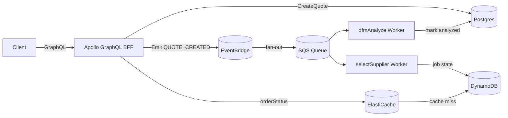

# Manufacturing Quote-to-Order Orchestrator

Event-driven workflow that turns a customer **quote** into a confirmed **order** with status tracking. Built with **Node.js (TypeScript)**, **Apollo GraphQL**, **AWS** concepts (SQS, EventBridge, Lambda-style workers), **RDS/Postgres**, **DynamoDB** (job state concept), and **Redis** caching. Clean Architecture, DDIA-friendly storage choices, Jest tests, and CI included.

## Architecture


### Clean Architecture layout
- `domain/`, `application/` (ports/use-cases), `adapters/` (inbound GraphQL / outbound repos), `infrastructure/` (clients), `workers/` (stubs), `infra/` (CDK skeleton).

## Local Quickstart
```bash
npm i
docker-compose up -d

# initialize DB schema
docker exec -i $(docker ps -qf name=postgres) psql -U postgres -d quoteorder < db/migrations/001_init.sql

cp .env.example .env
npm run dev    # http://localhost:4000/graphql
npm run workers
npm test
```

### Example GraphQL
```graphql
mutation { createQuote(input:{ partNumber:"PN-1001", quantity:25 }){ id status } }
mutation { placeOrder(quoteId:"<QUOTE_ID>"){ id status priceCents } }
query { orderStatus(id:"<ORDER_ID>") }
```

## Security & Quality
- Input validation (**zod**), **helmet** headers, JWT hook point, simple rate-limit placeholder.
- **Jest** unit/integration scaffolding; **CI** runs typecheck/lint/test/build.

## Observability
- **pino** logs, correlation-id hook, `/healthz`, `/readyz`.
